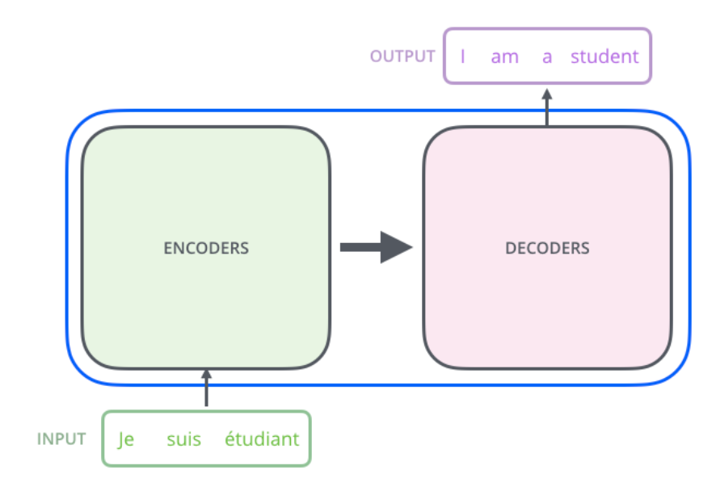
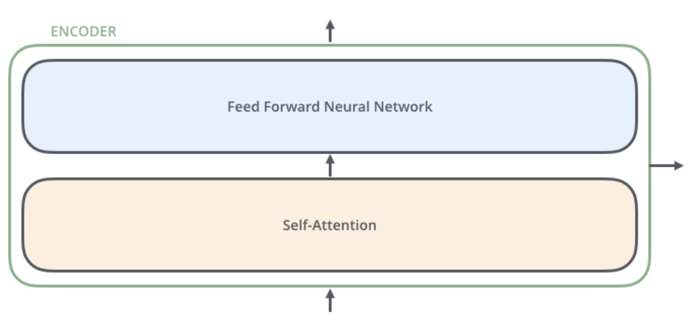
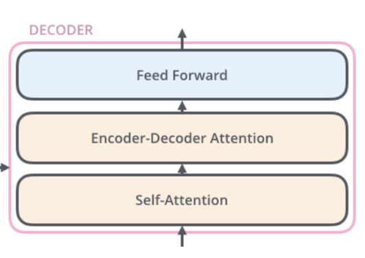
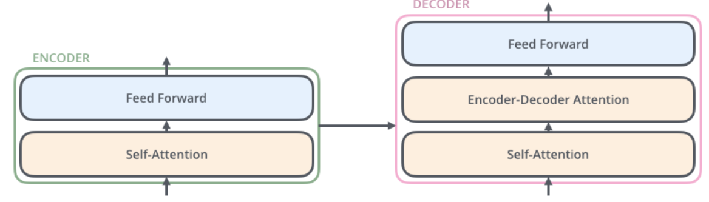

# Day 1 - Transformer Basics

# 1. What is Transformers? 

A transformer is a model that uses attention mechanism to understand relationships between all parts of the inputs and make accurate predictions.

*In simple terms:*
A transformer is an AI model which tells which parts of input are most important.

It consists of two components that are:

1. Encoder
2. Decoder



-------------------------------------------------


# 2. What is Encoder and Decoder?
 
Basically Encoder is a component where it understands the question.

And Decoder is a component which generates the answer based on the understanding.

*Lets understand it with an example:*

Lets say a person-A wants to talk to another person-B but they both speak different languages so they use a translator. So when Person-A spoke Hi! to the Person-B then the transformer takes place in between and in transformer there are two components so Encoder understands the question that is Hi and Decoder Generates Hola! based on the understanding.


-------------------------------------------------


# 3. What is Encoder?

As discussed Encoder is a component where it understands the question. 

Transformer have multiple Encoder layers (6 in original book, there can be more).

There are two sub-layers in Encoder:

1. Self-Attention
2. Feed Forward Neural Network




-------------------------------------------------


# 4. What is Decoder?

As discussed Decoder is a component where it gives the output by understanding the question from Encoder.

Transformer have multiple Decoder Layers (6 in original book, there can be more).

There are Three-layers in Decoder:

1. Masked Self-Attention
2. Encoder-Decoder Attention
3. Feed Forward




-------------------------------------------------


# 5. Encoder and Decoder.




-------------------------------------------------


# 6. What is Self-Attention in Encoder?

Every word can attend to every other word in the input.

So we can say that it is Bidirectional.

*For Example:*

I am going for Shopping.

So, it can see:
I, am, going, for, Shopping


-------------------------------------------------


# 7. What is Masked Self-Attention is Decoder?

Masked Self-Attention is where it cannot excess all elements one by one but cannot see while generation a particular one. For Example:

I am going for Shopping.

While generating for,
It can see only:

I, am, going ...
it cannot see for and shopping.


-------------------------------------------------


# 8. Difference between Self-Attention in Encoder and Masked(Hidden) Self-Attentionnin Decoder.

| Encoder                  | Decoder                            |
| ------------------------ | ---------------------------------- |
| Reads the entire input   | Produces the output token by token |
| Focuses on understanding | Focuses on generating              |
| Used in BERT             | Used in GPT                        |


-------------------------------------------------


# 9. What is Feed Forward Neural Network in Encoder and Decoder?

In a Transformer, the Feed Forward Network is a position-wise fully connected neural network that independently transforms each tokens vector after the attention mechanism, helping the model learn richer representations.

In simple:

An FNN is a Neural Nertwork which processes one input at a time, passing it to a linear layers and activation functions to produce a better output representation.


-------------------------------------------------


# 10. What is Encoder-Decoder Attention in Decoder?

Encoder-Decoder Attention(also called Cross-Attention) is used in Decoder in Transformer.
 
*Its purpose is to:*
to let the decoder look at the encoders output so it can generate the correct output.


-------------------------------------------------


# 11. Whole process of Transformer(Encoder-Decoder).

**Input (English):**

I love AI

**Output (French):**

J'aime l'IA

---
**Encoder (Understands the input)**

*Embedding*:
Convert words into vectors.
I -->
love -->
AI -->

---

*Self-Attention*:
Each word looks at all other words to understand the context.
Example: "love" learns that "I" is the subject and "AI" is the object.

---

*Feed Forward Network (FFN)*
Improves each word's vector independently.

---

*Output*
Produces context-rich vectors for the entire sentence.

---

Decoder (Generates the output)

*Masked Self-Attention*:
Looks only at the words generated so far.

Example:
J' --> J'aime --> J'aime l'IA

---

*Encoder-Decoder Attention (Cross-Attention)*:
Looks at the encoder's output to understand the English sentence while generating French.

---

*Feed Forward Network (FFN)*:
Refines each generated token's vector.

---

*Prediction*:
Predicts the next French word.
Repeats until the sentence is complete.


# AI version of my Notes for Accuracy.


# Day 1 - Transformers (The Illustrated Transformer)

## 1. What is a Transformer?

A **Transformer** is a deep learning model that uses the **attention mechanism** to understand relationships between all words in an input sentence and generate accurate outputs.

Unlike RNNs and LSTMs, a Transformer processes all words **at the same time (in parallel)** instead of one by one.

### In Simple Words

A Transformer is an AI model that identifies the most important parts of the input and uses that information to generate the correct output.

It consists of two main components:

1. Encoder
2. Decoder


---

# 2. What are Encoder and Decoder?

The Transformer has two main parts:

## Encoder

The Encoder reads and understands the input sentence.

## Decoder

The Decoder generates the output sentence based on the information received from the Encoder.

### Example

Suppose Person A speaks English and Person B speaks Spanish.

Person A says:

> Hi!

The Transformer acts like a translator.

- The **Encoder** understands the meaning of **"Hi!"**
- The **Decoder** generates the Spanish translation:

> ¡Hola!

The Encoder understands, and the Decoder generates.

---

# 3. What is Encoder?

The **Encoder** is the part of the Transformer that understands the input sentence.

It converts every word into a context-aware representation so that the model understands the meaning of each word based on the entire sentence.

The original Transformer contains **6 Encoder layers** (modern Transformers may have more or fewer).

Each Encoder layer contains two sub-layers:

1. Multi-Head Self-Attention
2. Feed Forward Neural Network (FFN)


### Purpose

To create meaningful representations of the input sentence that the Decoder can use.

---

# 4. What is Decoder?

The **Decoder** is the part of the Transformer that generates the output sentence one word (or token) at a time.

It uses:

- The words generated so far
- The information received from the Encoder

to predict the next word.

The original Transformer contains **6 Decoder layers**.

Each Decoder layer consists of:

1. Masked Multi-Head Self-Attention
2. Encoder-Decoder Attention (Cross Attention)
3. Feed Forward Neural Network (FFN)


---

# 5. Encoder and Decoder

The overall flow of a Transformer looks like this:

```text
Input Sentence
      │
      ▼
   Encoder
      │
      ▼
Context Representation
      │
      ▼
   Decoder
      │
      ▼
Output Sentence
```


---

# 6. What is Self-Attention in Encoder?

Self-Attention allows **every word to look at every other word** in the input sentence to understand the context.

This means the Encoder can understand how words are related to each other.

Since every word can attend to every other word, it is called **Bidirectional Attention**.

### Example

Sentence:

> I am going for shopping.

When processing **going**, it can look at:

- I
- am
- going
- for
- shopping

This helps the model understand the complete meaning of the sentence.

---

# 7. What is Masked Self-Attention in Decoder?

The Decoder generates the output **one word at a time**.

While generating the current word, it is **not allowed to see future words**.

This is achieved using **Masking**.

### Example

Sentence:

> I am going for shopping.

While generating **for**, the Decoder can only see:

- I
- am
- going

It **cannot see**

- for
- shopping

Otherwise, the model would already know the correct answer during training.

---

# 8. Difference Between Encoder Self-Attention and Decoder Masked Self-Attention

| Encoder Self-Attention | Decoder Masked Self-Attention |
|-------------------------|-------------------------------|
| Can attend to every word in the input sentence | Can attend only to previously generated words |
| Used for understanding | Used for generating output |
| Bidirectional | Unidirectional |
| Used in Encoder | Used in Decoder |
| Example: BERT | Example: GPT |

---

# 9. What is Feed Forward Neural Network (FFN)?

After the attention layer, every word passes through a **Feed Forward Neural Network (FFN)**.

The same FFN is applied independently to every word.

Its purpose is to learn richer and more meaningful representations of each word.

### In Simple Words

The FFN improves each word's representation after the attention mechanism.

---

# 10. What is Encoder-Decoder Attention (Cross Attention)?

Encoder-Decoder Attention (also called **Cross Attention**) is used only inside the Decoder.

Its purpose is to allow the Decoder to focus on the most relevant parts of the Encoder's output while generating each new word.

### In Simple Words

The Decoder keeps looking back at the Encoder's understanding so it can generate the correct output.

---

# 11. Complete Working of a Transformer

### Input (English)

> I love AI

### Output (French)

> J'aime l'IA

---

## Step 1: Embedding

Every word is converted into numerical vectors.

```
I      → Embedding
love   → Embedding
AI     → Embedding
```

---

## Step 2: Self-Attention

Each word looks at every other word to understand the complete context.

Example:

The word **love** understands that:

- **I** is the subject.
- **AI** is the object.

---

## Step 3: Feed Forward Network

Each word is processed independently to improve its representation.

---

## Step 4: Encoder Output

The Encoder produces context-aware representations of the input sentence.

These representations are passed to the Decoder.

---

## Step 5: Masked Self-Attention

The Decoder generates the output one word at a time.

Example:

```
J'
↓

J'aime
↓

J'aime l'
↓

J'aime l'IA
```

It cannot see future words while generating the current word.

---

## Step 6: Encoder-Decoder Attention

The Decoder looks back at the Encoder's output to understand the English sentence while generating the French translation.

---

## Step 7: Feed Forward Network

The generated word representation is further refined.

---

## Step 8: Prediction

The Decoder predicts the next word.

This process repeats until the complete sentence is generated.

---

# Key Takeaways

- Transformer consists of an **Encoder** and a **Decoder**.
- Encoder understands the input sentence.
- Decoder generates the output sentence.
- Self-Attention allows every word to understand the context by looking at all other words.
- Masked Self-Attention prevents the Decoder from seeing future words.
- Feed Forward Networks improve each word's representation independently.
- Cross Attention helps the Decoder focus on the Encoder's output.
- Transformers process words **in parallel**, making them faster than RNNs and LSTMs.

---

# Interview Questions

1. What is a Transformer?
2. Why were Transformers introduced?
3. What is the difference between Encoder and Decoder?
4. What is Self-Attention?
5. What is Masked Self-Attention?
6. Why is Masking required?
7. What is Cross Attention?
8. What is the purpose of the Feed Forward Network?
9. How are Transformers different from RNNs?
10. Why are Transformers faster than LSTMs?


